## Exercise - Investigating a file based attack

### Prereqs

To complete this exercise you will need an Azure subscription with Copilot for Security onboarded. In addition you will need a Windows device onboarded to Defender for Endpoint in the same  tenancy. You will need either a license for **Defender for Endpoint** or alternatively, in the Azure subscription, configure Defender for Servers within Defender for Cloud. Steps for either option are in the links below.

https://learn.microsoft.com/en-us/defender-endpoint/configure-endpoints-script

https://learn.microsoft.com/en-us/defender-endpoint/azure-server-integration

To open the file used to simulate the attack you will need **Word** installed locally on the Windows device.

Before continuing with this exercise ensure that an asset representing the device appears in Defender XDR

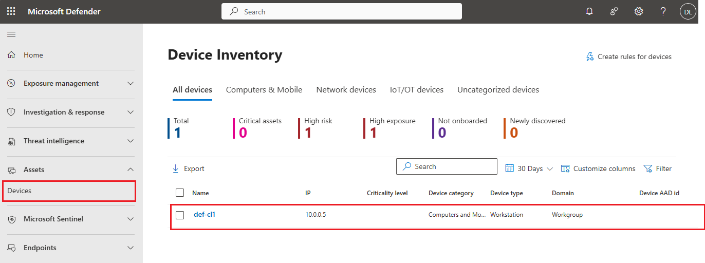

### Task 1 - Generating the incident

1.	On the Windows device, sign in if required.
2.	In the browser download the simulation file.
[AttackSimulationFileAttack](https://blazingwheelssamples.blob.core.windows.net/samplefiles/AttackSimulationDIYv4_FileAttack.zip)

3. After the file has downloaded, click **Show in folder**.

 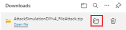

4.	Right click the downloaded zipped file and select **Extract all**.
5.  Click **Extract**.
6.	Right click RS4_WinATP-Intro-Invoice and click **Properties**.
7.	In the properties dialogue box, click **Unblock**.

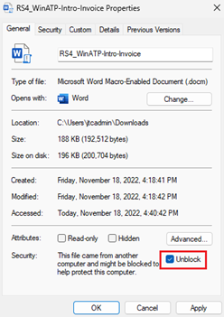

8.	Click **OK**.
9.	Double click the file to open it.
10.	For a password, enter WDATP!diy#
11.	In Word, at the top of the document, click **Enable Content**.

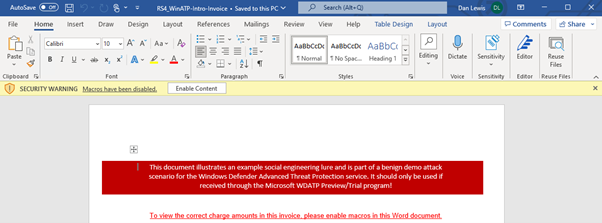

12.	Review the Word pop up and click **OK**.

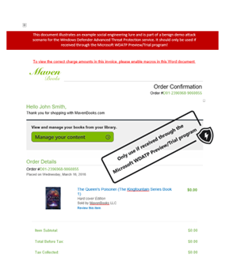

13. Wait for around 5 minutes for the alerts and incident to be generated in Defender XDR.
14.	Navigate to Defender XDR at https://security.microsoft.com/
15.	Expand **Investigation & response > Incidents & alerts > Incidents**.

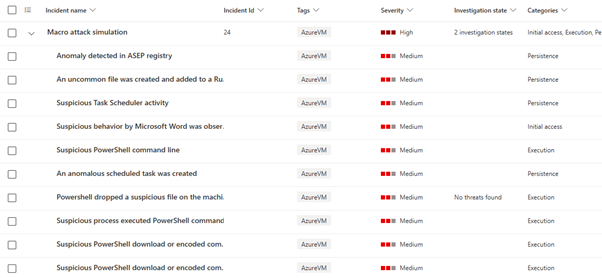

### Task 2 - Investigating the incident

1.	Navigate to Defender XDR at https://security.microsoft.com/
2.	Expand **Investigation & response > Incidents & alerts > Incidents**.
3.	Click on the name of the **incident** that relates to the simulated macro attack.

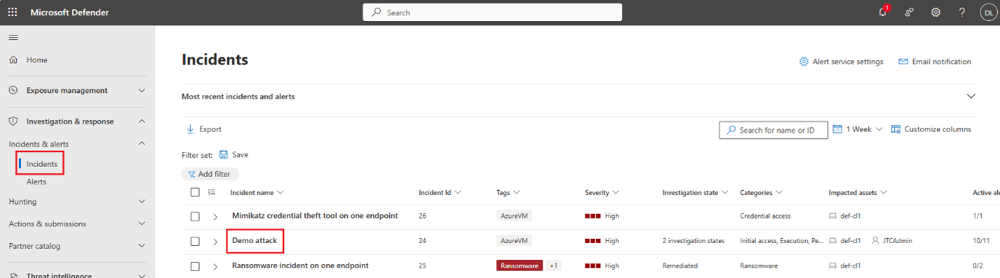

4.	Review the Attack story of the incident.
5.	Click the **Copilot icon** at the top right of the incident.
6.	Review the incident summary.

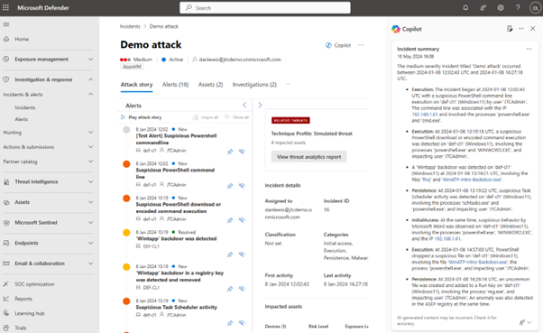

7.	Scroll down the alerts in the Attack story until you find the suspicious PowerShell command.
8.	Click **View more**.

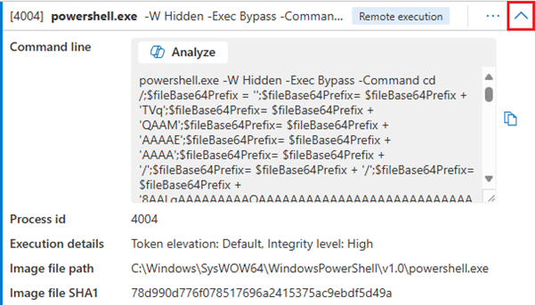 

9.	Review the encoded script.
10.	Click **Analyze**.
11.	Review the script analysis provided by Copilot for Security.

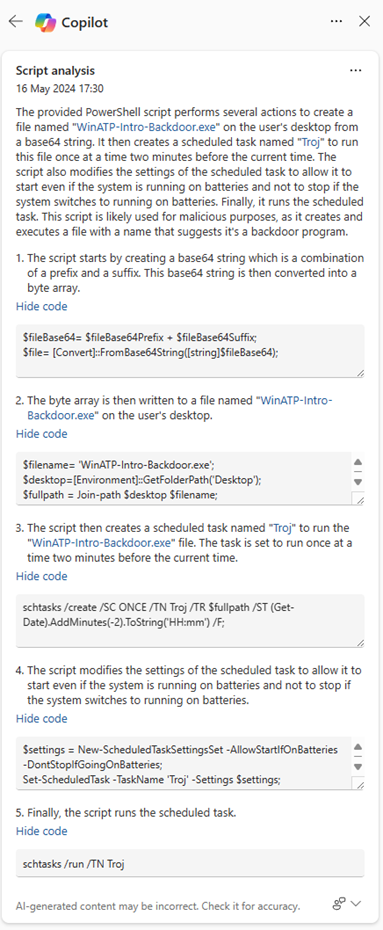 

### Task 3 - Reporting on the incident

1.	Reopen the incident if required.
2.	From the menu **…** at the top of the incident, click **Generate incident report**.

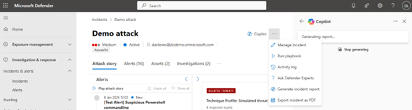

3.	Review the incident report.

